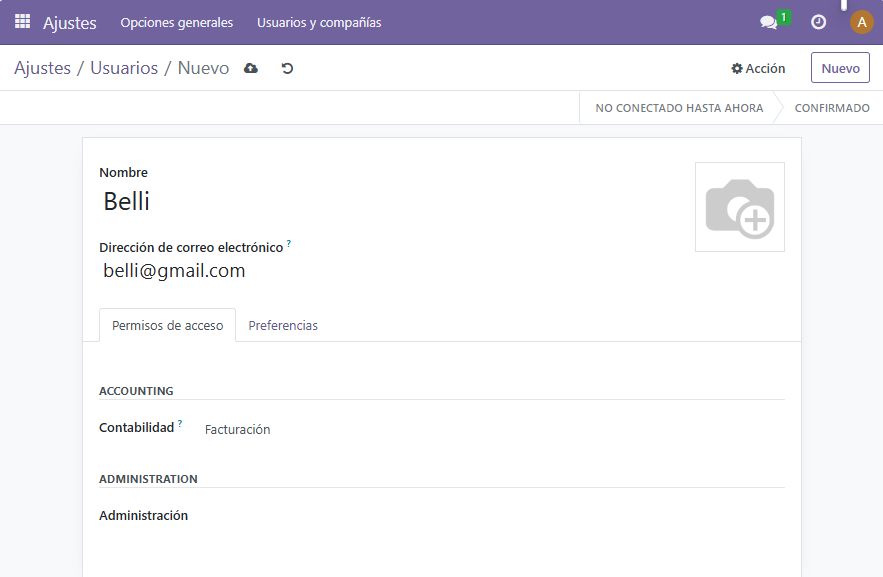
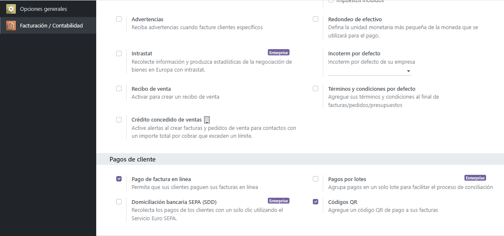
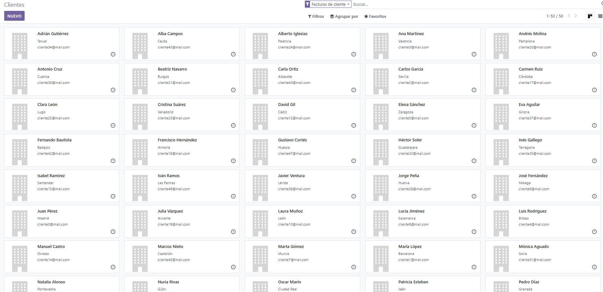
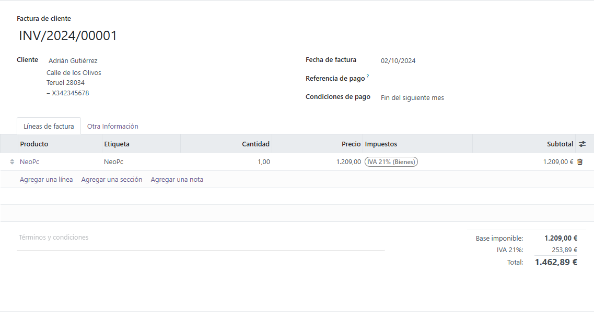

# **PR0301** 

## Paso 1 (creacion de la empresa)

Tras haber agregado el modulo de **"Facturación"** nos dirigimos a **"Ajustes"** en **"Opciones Generales"** y vamos a la sección **"Compañias"**,  pinchando en **"Gestionar Compañias"** donde crearemos la empresa y añadiremos sus correspondientes datos.

## Paso 2 (creacion del nuevo usuario)

En el **"Opciones generales"** nos desplazamos arriba del todo para encontrar la seccion de **"Usuarios"** donde pincharemos en **"Gestionar Usuarios"** y crearemos un nuevo usuario

## Paso 3 (configuracion de las facturas)

Marco la opcion de introducir Qr a a las practicas

Ahora, nos dirigimos a **"Facturas/Contabilidad"** y pinchamos en la opcion **"Diseño de Factura"**. Personalizando esta misma con su icono, fondo y cambiando los colores de los encabezados

## Paso 4 (importar clientes)

En el menu superior morado al lado de **"Facturas/Contabilidad"** seleccionaremos en el desplegable **"Clientes"**. Al estar dentro de clientes pincharemos en **"Favoritos"** e importaremos los registros en el archivo `.excel`.

Al importarlo relacionaremos los campos del archivo excel con los de la base de datos que posee Odoo. Al estar todo terminado importaremos y se nos añadiran todos los clientes que estaban escritos en el archivo `.excel`.

## Paso 5 (Acceder con el Usuario que hemos creado)

**"Ajustes"** y pinchamos en la primera opción **"Gestionar Usuarios"**. Una vez dentro pincho en `Belli` (mi usuario que cree antes) y le cambio la contraseña en este caso le asignare `villabalter1`

Al cambiar la contraseña, cerraremos sesión e iniciaremos sesion el usuario creado anteriormente

## Paso 6 (Creacion de la factura con el nuevo usuario)

Ahora, nos dirigimos a **"Facturas/Contabilidad"** y pinchamos de nuevo la opcion **"Facturas"**. Esta vez le daremos a la ultima opcion de **"Crear factura"** donde seleccionaremos un cliente y rellenaremos el resto de datos

Al finalizar se nos dara la opcion para descargar una vista previa de la factura

Enlace a documento PDF [Link](./Factura.pdf)

