# **PR0302** 

## Paso 1 (Añadir modulo empresa)
Accedemos a Odoo y nos vamos a **"Aplicaciones"** donde en su buscador escribiremos el módulo en cuestión `Inventario` y lo activamos.

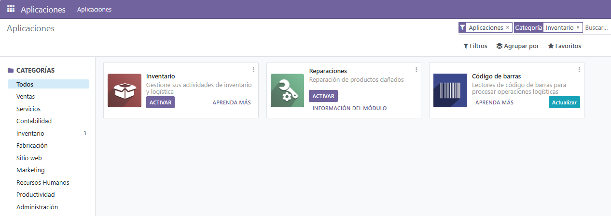

## Paso 2 (Importamos productos)

Una vez dentro del módulo `Inventario` nos vamos a **"Productos"** y al pinchar en favoritos pincharemos en la opción **"importar registros"** donde seleccionaremos el archivo excel de `libros`

Al importarlo relacionaremos los campos del archivo excel con los de la base de datos que posee Odoo. Al estar todo terminado importaremos y se nos añadiran todos los libros que estaban escritos en el archivo `.excel`.

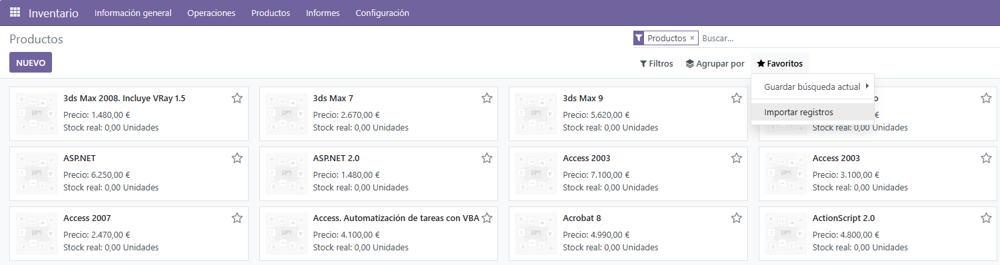

## Paso 3 (Creación de la Api)

Accedemos a la siguiente dirección https://console.cloud.google.com/apis/dashboard para obtener nuestra Api con nuestra cuenta de google y le daremos a la opcion **Crear Proyecto** donde se nos aparecera por pantalla la siguiente imagen

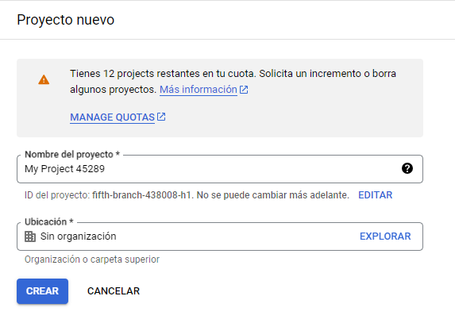

Al crearlo se nos dirigiremos a **credenciales** y en **crear credenciales** seleccionaremos crear una nueva Api. Pocos segundos despues de pulsar se nos habra creado la Api con un codigo

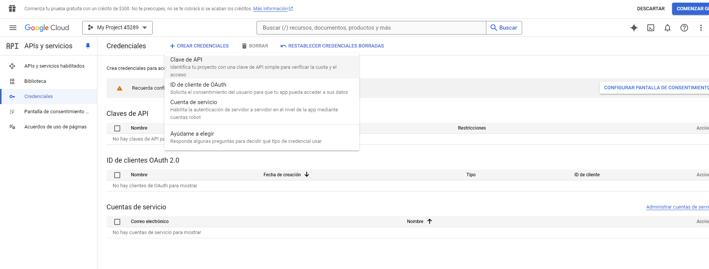

Buscamos **Custom Search API** y le daremos a habilitar

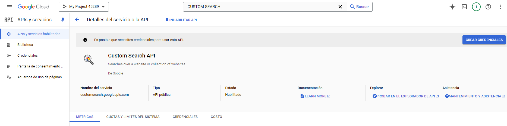

Con la api creada nos dirigimos a esta dirección https://programmablesearchengine.google.com/ y crearemos un nuevo buscador donde lo rellenaremos. Para al final tener nuestro propio buscador

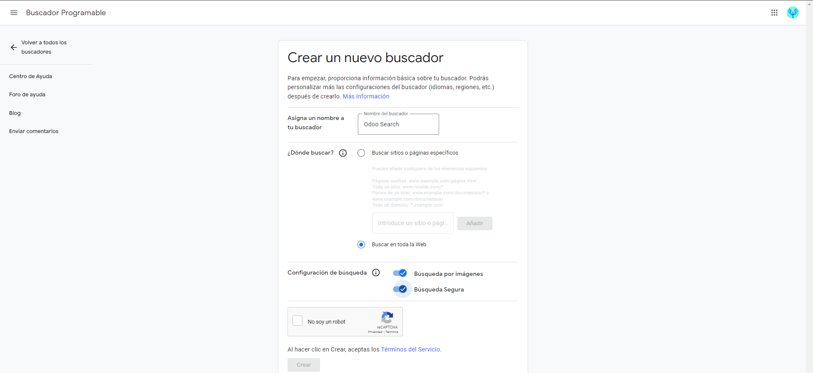

Y luego al darle a personalizar obtendremos el `Id del buscador`

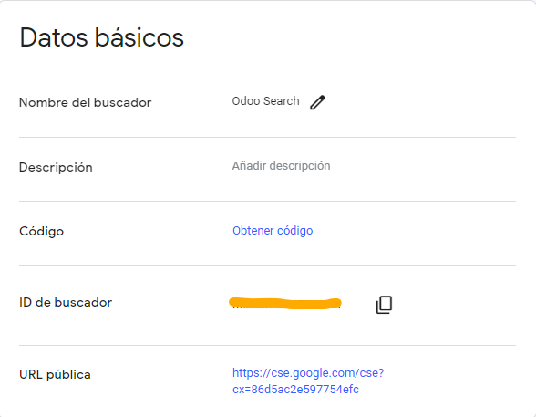

## Paso 4 (Implementación a Odoo)

Volvemos abrir Odoo iniciando sesión con nuestro usuario y nos vamos a **Ajustes** en la seccion **Integraciones** para marcar la opción **Google imagenes**, luego le damos a **guardar** para aplicar los cambios

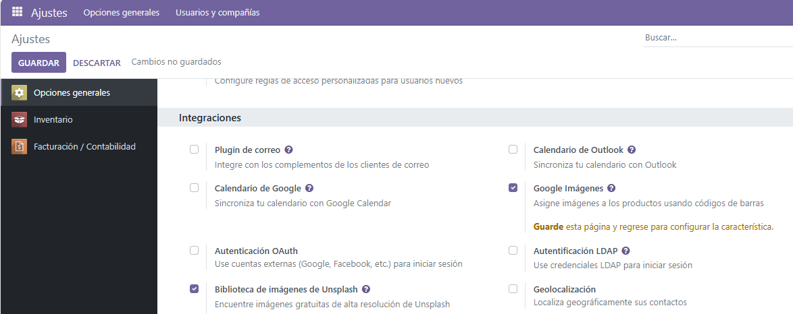

Al actualizarse nos apareceran en la misma seccion dos cambos nuevos donde pegaremos los codigos de la `api` y del `buscador`

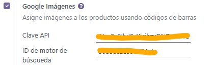

El ultimo paso es ir a nuestro modulo de **inventario** donde tenemos nuestros productos **importados** de antes. Haremos click en el que queramos y en el boton de **Acción** seleccionaremos **Obtener imagenes de Google imagenes**

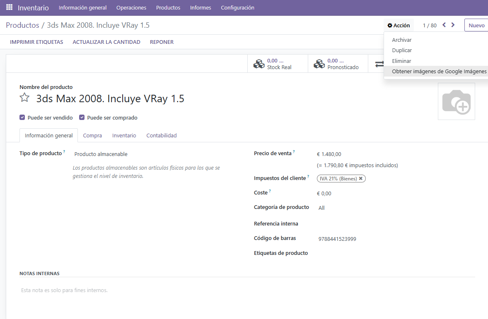

Y repetiremos este procedimento las veces que sean necesarias

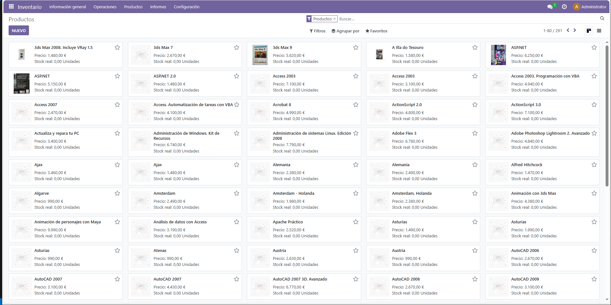