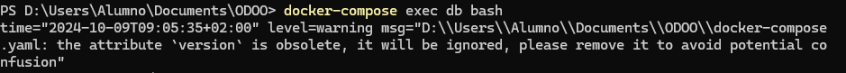
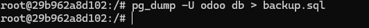
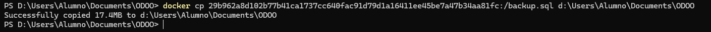
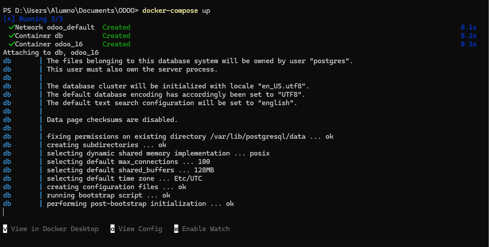
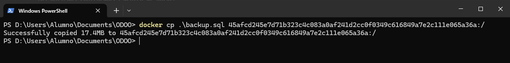
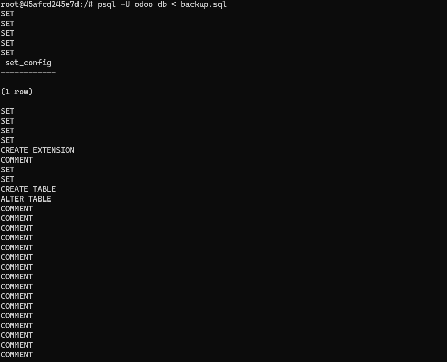
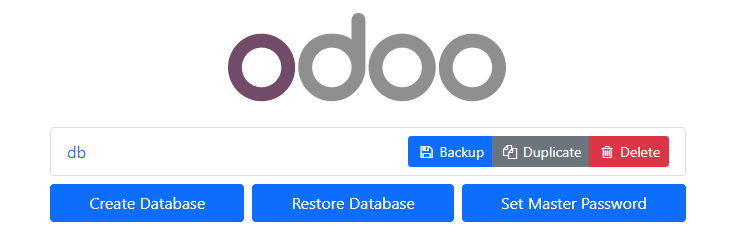
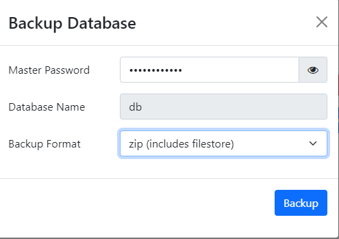
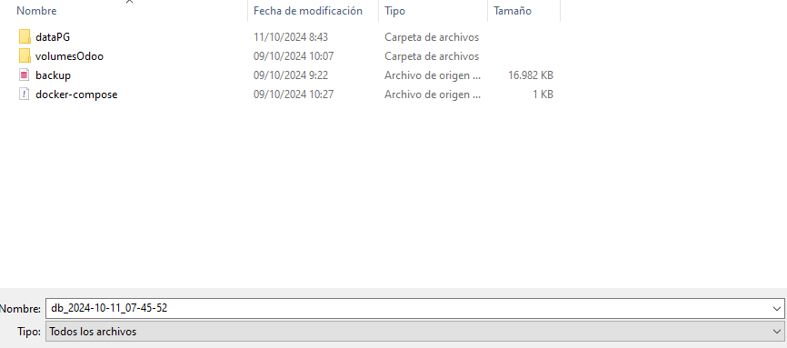
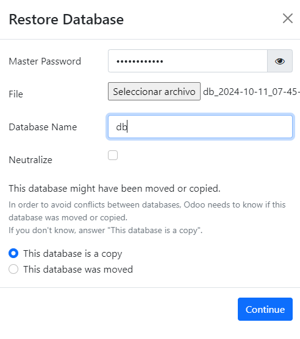

# **Ejercicio 1**

**Crea una copia de seguridad de la base de datos de Odoo utilizando la herramienta pg_dump.**

Accedemos a la terminal yendo a la carpeta donde se encuentra odoo y abrimos la terminal

Usamos el comando para realizar una copia de la base de datos

Ahora con el `docker cp` indicando la ruta donde esta el `backup` y la ruta de la maquina fisica donde lo queremos guardar

---

**Elimina completamente los contenedores en Docker Desktop y vacía el contenido de los directorios que tienes mapeados en tu equipo (dataPG, sessions, filestore y addons).**

Borramos todos los archivos dentro de las carpetas `Datapg` `Filestore` `addons` `sessions`. Y los antiguos contenedores dentro de Docker

---

**Crea nuevamente los contenedores con docker compose, comprueba que el servidor no tiene datos y restaura los datos desde la copia de seguridad que has creado.**

En la terminal usamos `docker-compose  up` para levantar todos los contenedores

Ahora usando el comando `docker cp` introducimos realizamos el mismo comando pero a la inversa. Primero la ruta de la maquina fisica donde esta el `backup.sql` y luego la ruta de la maquina virtual donde queremos que se vuelque

Ahora con `psql -U usuario + nombre de la base de datos < archivo con la copia de seguridad`

---

# **Ejercicio 2**

**Crea una copia de seguridad de la base de datos utilizando la interfaz gráfica, asegúrate de que la copia de seguridad contenga tanto los datos de la base de datos, como el contenido del directorio filestore.**

Accedemos a esta direccion `http://localhost:8069/web/database/manager` y seleccionamos `backup`

Al pulsarlo rellenaremos los datos escribiendo la clave maestra, el nombre de la base de datos y el tipo de archivo que quieras generar para guardar la copia

Al rellenar todo nos pedira el lugar donde queremos guardar el archivo en nuestro zip

**Al igual que en el ejercicio anterior, elimina los contenedores y el contenido de los directorios mapeados en tu máquina física.**

Borramos todos los archivos dentro de las carpetas `Datapg` `Filestore` `addons` `sessions`. Y los antiguos contenedores dentro de Docker

**Ahora restaura la copia de seguridad con la herramienta psql para la base de datos y copiando directamente el contenido de filestore en el directorio que hemos mapeado en nuestra máquina física.**

Accedemos otra vez a esta direccion `http://localhost:8069/web/database/manager` y seleccionamos `restore database`

rellenamos los campos con la crontraseña maestra seleccionamo seleccionamos al archivo zip junto con el nombre de la base de datos

