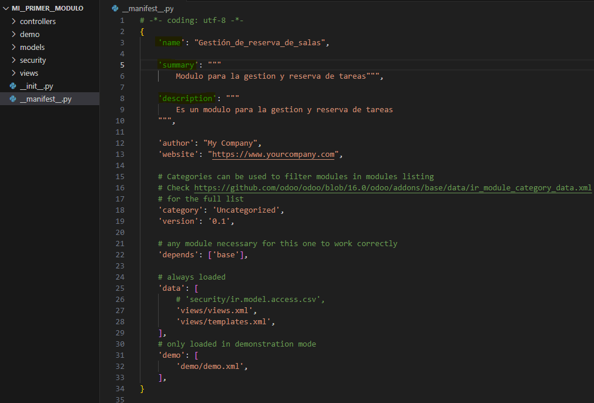
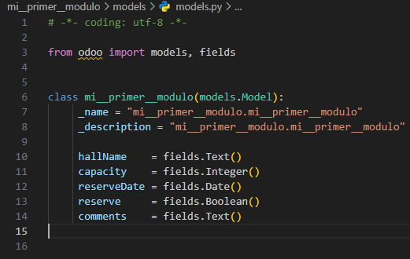
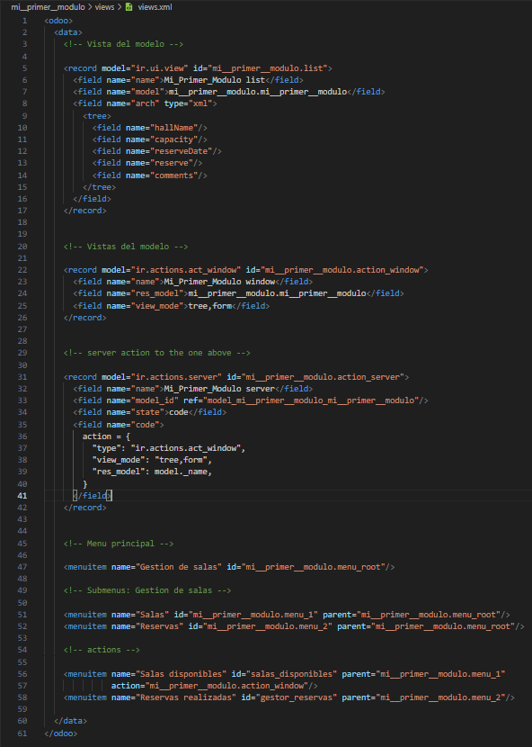
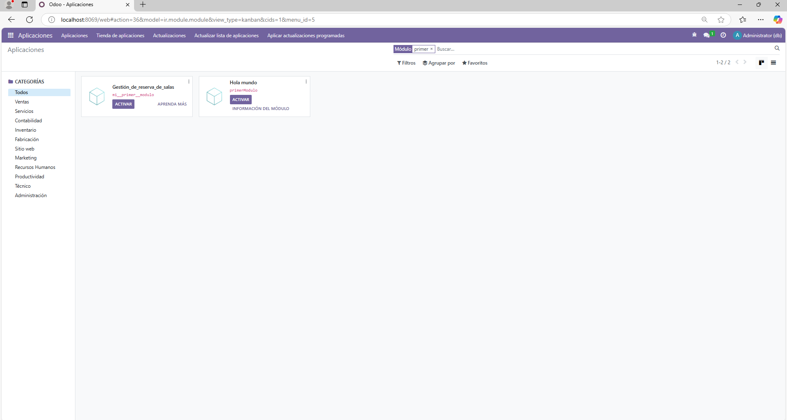

# **PR0501**

## Paso 1 (Añadir creacion de directorio y archivos)
Dentro de donde tenemos todos los repositorio de **"Docker"** vamos a la carpeta **addons** para abrir una terminal dentro de esta.
(Teniendo el Docker encendido) Abrimos una terminal con el `docker compose exec odoo bash` y acto seguido escribimos el comando `odoo scaffold <NombreQueQuieras> /mnt/extra-addons/`

Al ejecutarlo en la carpeta **addons** se no screara la carpeta con el nombre de antes seguido de todos los archivos

## Paso 2 (MANIFEST)

Ve al archivo **"__manifest__.py"**. Y cambiar el name, el summary "resumen" y la descripcion



## Paso 3 (MODELS)

Ahora vamos al archivo **"models.py"**. Y añadimos los cambos con su respectivo tipo de dato (obviamente descomentando todo)



```
coding: utf-8

from odoo import models, fields


class mi__primer__modulo(models.Model):
     _name = "mi__primer__modulo.mi__primer__modulo"
     _description = "mi__primer__modulo.mi__primer__modulo"

     hallName    = fields.Text()
     capacity    = fields.Integer()
     reserveDate = fields.Date()
     reserve     = fields.Boolean()
     comments    = fields.Text()

```

## Paso 4 (VIEWS)

Por ultimo en el archivo **"views.xml"**. Descomentamos todo, en la primera parte la rellenamos con los campos del archivo **models** y en la ultima añadimos los menus correspondientes



```
<odoo>
  <data>
    <!-- Vista del modelo -->

    <record model="ir.ui.view" id="mi__primer__modulo.list">
      <field name="name">Mi_Primer_Modulo list</field>
      <field name="model">mi__primer__modulo.mi__primer__modulo</field>
      <field name="arch" type="xml">
        <tree>
          <field name="hallName"/>
          <field name="capacity"/>
          <field name="reserveDate"/>
          <field name="reserve"/>
          <field name="comments"/>
        </tree>
      </field>
    </record>


    <!-- Vistas del modelo -->

    <record model="ir.actions.act_window" id="mi__primer__modulo.action_window">
      <field name="name">Mi_Primer_Modulo window</field>
      <field name="res_model">mi__primer__modulo.mi__primer__modulo</field>
      <field name="view_mode">tree,form</field>
    </record>


    <!-- server action to the one above -->

    <record model="ir.actions.server" id="mi__primer__modulo.action_server">
      <field name="name">Mi_Primer_Modulo server</field>
      <field name="model_id" ref="model_mi__primer__modulo_mi__primer__modulo"/>
      <field name="state">code</field>
      <field name="code">
        action = {
          "type": "ir.actions.act_window",
          "view_mode": "tree,form",
          "res_model": model._name,
        }
      </field>
    </record>


    <!-- Menu principal -->

    <menuitem name="Gestion de salas" id="mi__primer__modulo.menu_root"/>

    <!-- Submenus: Gestion de salas -->

    <menuitem name="Salas" id="mi__primer__modulo.menu_1" parent="mi__primer__modulo.menu_root"/>
    <menuitem name="Reservas" id="mi__primer__modulo.menu_2" parent="mi__primer__modulo.menu_root"/>

    <!-- actions -->

    <menuitem name="Salas disponibles" id="salas_disponibles" parent="mi__primer__modulo.menu_1"
              action="mi__primer__modulo.action_window"/>
    <menuitem name="Reservas realizadas" id="gestor_reservas" parent="mi__primer__modulo.menu_2"/>

  </data>
</odoo>
```

## Paso 5 (Se ha creado)


