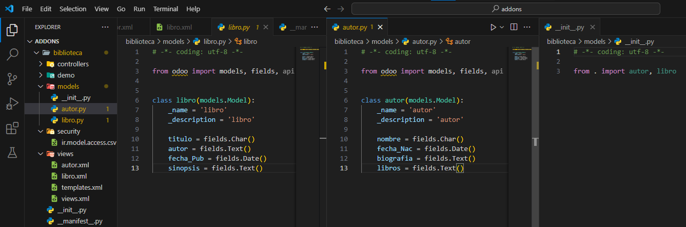
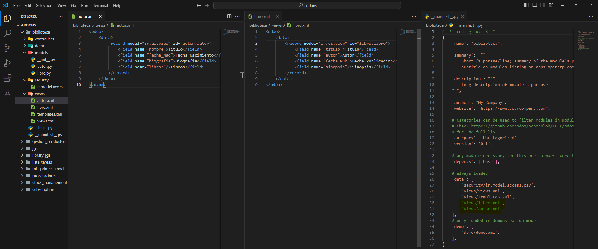
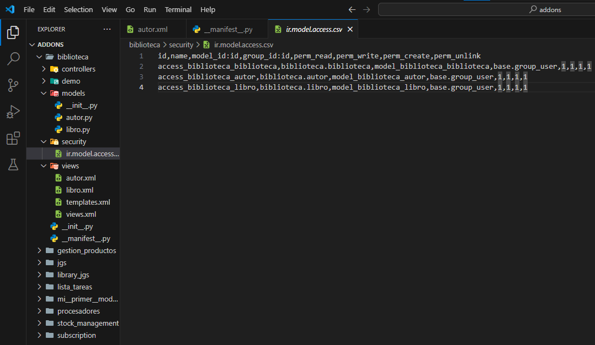
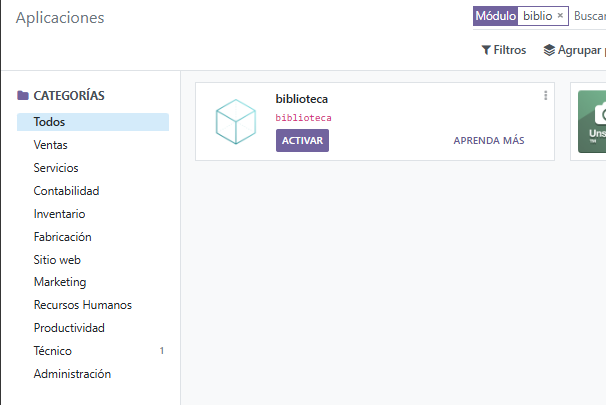

# **PR0502**

## Paso 1 (Añadir creacion de directorio y archivos)
Dentro de donde tenemos todos los repositorio de **"Docker"** vamos a la carpeta **addons** para abrir una terminal dentro de esta.
(Teniendo el Docker encendido) Abrimos una terminal con el `docker compose exec odoo bash` y acto seguido escribimos el comando `odoo scaffold <NombreQueQuieras> /mnt/extra-addons/`

## Paso 2 (Crear modelos)
Vamos a la carpeta de modelos y creamos dos archivos para luego declarar los nombres de los mismos en el 'init' de la misma carpeta

## Paso 3 (Crear los views)
En la carpeta views creamos un xml por cada modelo agregando los campos que hemos escrito antes, luego nos dirigimos al 'manifest' para poner la ruta de ambos

## Paso 4 (Security)
Por ultimo vamos al unico archivo de la carpeta 'Security' para declarar ambos modelos

 

## Paso 5 (Comprobar su creación)

Encendemos odoo y activamos el 'modo desarrollador'  de ahi nos dirigimos a la pestaña de 'aplicaciones' y buscamos el nombre de nuestro modelo

 