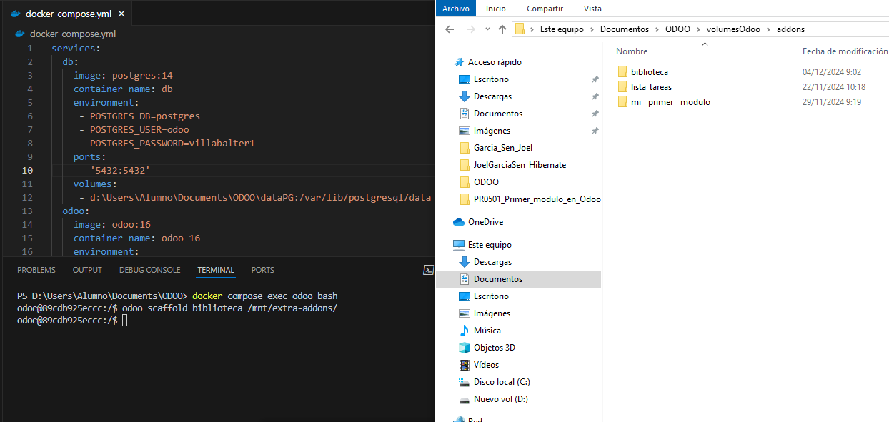

# **PR0502**

## Paso 1 (Añadir creacion de directorio y archivos)
Dentro de donde tenemos todos los repositorio de **"Docker"** vamos a la carpeta **addons** para abrir una terminal dentro de esta.
(Teniendo el Docker encendido) Abrimos una terminal con el `docker compose exec odoo bash` y acto seguido escribimos el comando `odoo scaffold <NombreQueQuieras> /mnt/extra-addons/`

## Paso 2 ()

## Paso 3 ()

## Paso 4 ()

## Paso 5 ()