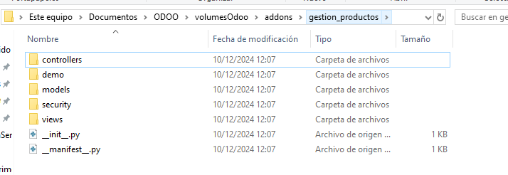
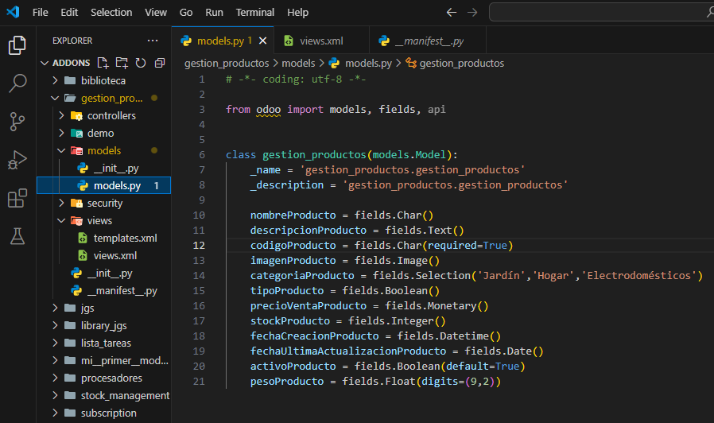
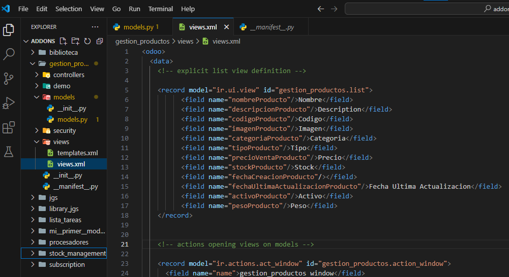
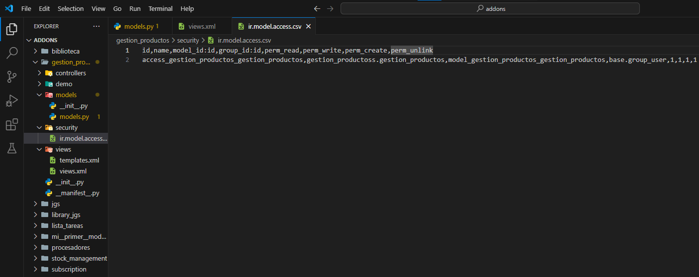
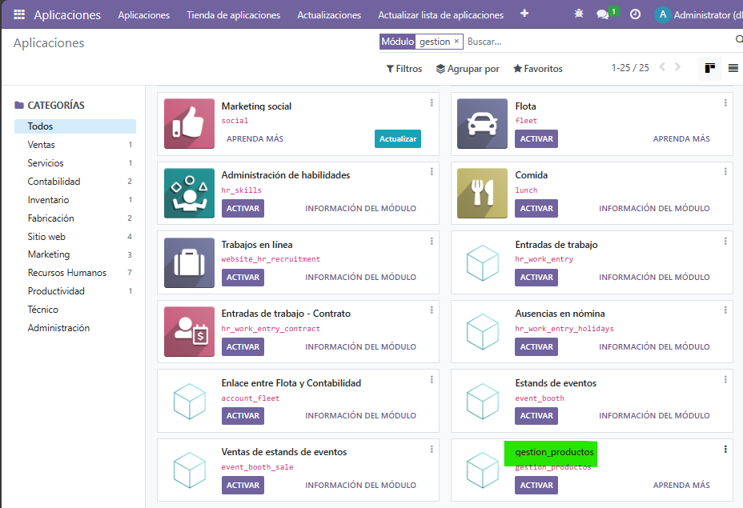

# **PR0601**

## Paso 1 (Añadir creacion de directorio y archivos)
Dentro de donde tenemos todos los repositorio de **"Docker"** vamos a la carpeta **addons** para abrir una terminal dentro de esta.
(Teniendo el Docker encendido) Abrimos una terminal con el `docker compose exec odoo bash` y acto seguido escribimos el comando `odoo scaffold <NombreQueQuieras> /mnt/extra-addons/`

## Paso 2 (MODELS)

Vamos a la carpeta de modelos y creamos el archivo para luego declarar el nombre del mismo en `init` de la misma carpeta

## Paso 3 (VIEWS)

En la carpeta views creamos un xml por cada modelo agregando los campos que hemos escrito antes, luego nos dirigimos al `manifest` para poner la ruta de ambos

En la carpeta 'Security' para declarar ambos modelos

## Paso 4 (Security)

## Paso 5 (Odoo)

Al iniciar odoo ya lo tendremos creado

