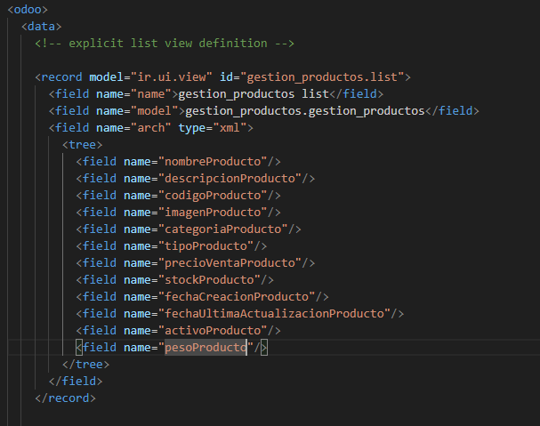

# **PR0601**

## Paso 1 (Añadir creacion de directorio y archivos)
Dentro de donde tenemos todos los repositorio de **"Docker"** vamos a la carpeta **addons** para abrir una terminal dentro de esta.
(Teniendo el Docker encendido) Abrimos una terminal con el `docker compose exec odoo bash` y acto seguido escribimos el comando `odoo scaffold <NombreQueQuieras> /mnt/extra-addons/`

## Paso 2 (MODELS)

Ahora vamos al archivo **"models.py"**. Y añadimos los cambos con su respectivo tipo de dato (obviamente descomentando todo)

## Paso 3 (VIEWS)

Por ultimo en el archivo **"views.xml"**. Descomentamos todo, en la primera parte la rellenamos con los campos del archivo **models** y en la ultima añadimos los menus correspondientes

