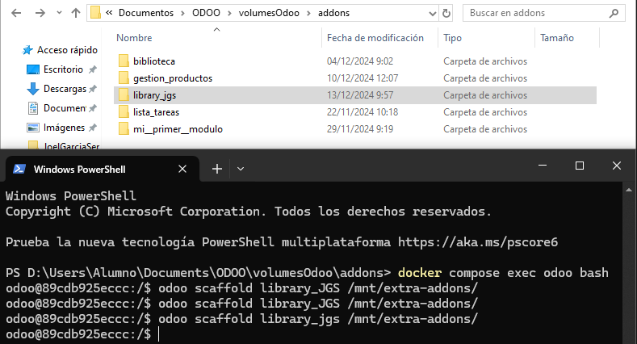
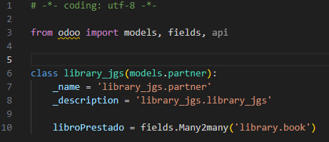
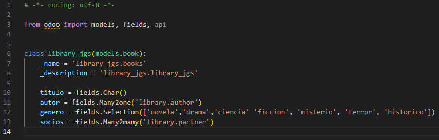
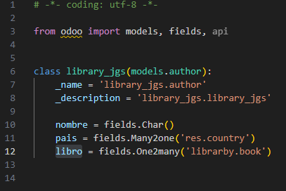
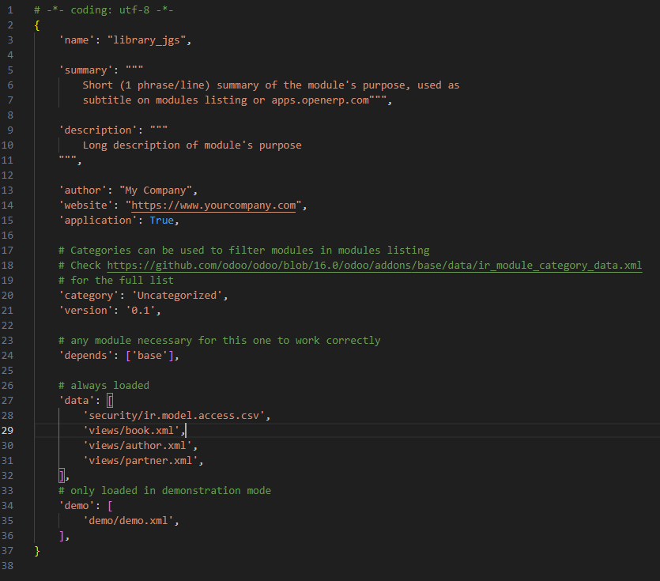
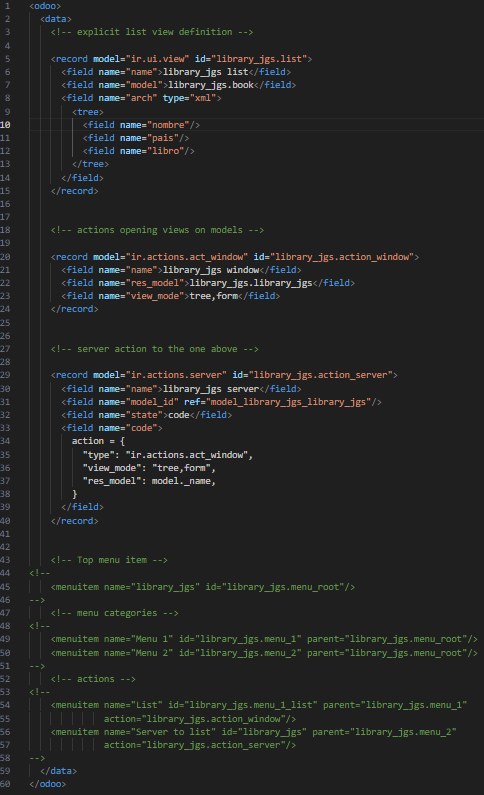
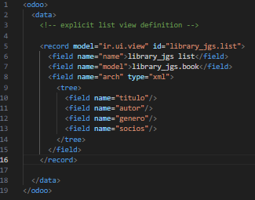
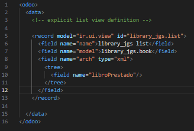

# **PR0602**

## Paso 1 (Añadir creacion de directorio y archivos)
Dentro de donde tenemos todos los repositorio de **"Docker"** vamos a la carpeta **addons** para abrir una terminal dentro de esta.
(Teniendo el Docker encendido) Abrimos una terminal con el `docker compose exec odoo bash` y acto seguido escribimos el comando `odoo scaffold <NombreQueQuieras> /mnt/extra-addons/`

## Paso 2 (MODELS)

Ahora vamos al archivo **"models.py"**. Y añadimos los cambos con su respectivo tipo de dato (obviamente descomentando todo)

**Socios**

`
# -*- coding: utf-8 -*-

from odoo import models, fields, api

class library_jgs(models.partner):
    _name = 'library_jgs.partner'
    _description = 'library_jgs.library_jgs'

    libroPrestado = fields.Many2many('library.book')
`

**Libros**

`
# -*- coding: utf-8 -*-

from odoo import models, fields, api

class library_jgs(models.book):
    _name = 'library_jgs.books'
    _description = 'library_jgs.library_jgs'

    titulo = fields.Char()
    autor = fields.Many2one('library.author')
    genero = fields.Selection(['novela','drama','ciencia' 'ficcion', 'misterio', 'terror', 'historico'])
    socios = fields.Many2many('library.partner')

`

**Autores**

`
# -*- coding: utf-8 -*-

from odoo import models, fields, api

class library_jgs(models.author):
    _name = 'library_jgs.author'
    _description = 'library_jgs.library_jgs'

    nombre = fields.Char()
    pais = fields.Many2one('res.country')
    libro = fields.One2many('librarby.book')
`

## Paso 3 (MANIFEST)

--

`
# -*- coding: utf-8 -*-
{
    'name': "library_jgs",

    'summary': """
        Short (1 phrase/line) summary of the module's purpose, used as
        subtitle on modules listing or apps.openerp.com""",

    'description': """
        Long description of module's purpose
    """,

    'author': "My Company",
    'website': "https://www.yourcompany.com",
    'application': True,

    # Categories can be used to filter modules in modules listing
    # Check https://github.com/odoo/odoo/blob/16.0/odoo/addons/base/data/ir_module_category_data.xml
    # for the full list
    'category': 'Uncategorized',
    'version': '0.1',

    # any module necessary for this one to work correctly
    'depends': ['base'],

    # always loaded
    'data': [
        'security/ir.model.access.csv',
        'views/book.xml',
        'views/author.xml',
        'views/partner.xml',
    ],
    # only loaded in demonstration mode
    'demo': [
        'demo/demo.xml',
    ],
}
`

## Paso 4 (VIEWS)

---

**Autores**

`
<odoo>
  <data>
    <!-- explicit list view definition -->

    <record model="ir.ui.view" id="library_jgs.list">
      <field name="name">library_jgs list</field>
      <field name="model">library_jgs.book</field>
      <field name="arch" type="xml">
        <tree>
          <field name="nombre"/>
          <field name="pais"/>
          <field name="libro"/>
        </tree>
      </field>
    </record>
  </data>
</odoo>
`

**Libros**

`
<odoo>
  <data>
    <!-- explicit list view definition -->

    <record model="ir.ui.view" id="library_jgs.list">
      <field name="name">library_jgs list</field>
      <field name="model">library_jgs.book</field>
      <field name="arch" type="xml">
        <tree>
          <field name="titulo"/>
          <field name="autor"/>
          <field name="genero"/>
          <field name="socios"/>
        </tree>
      </field>
    </record>

  </data>
</odoo>
`

**Socios**

`
<odoo>
  <data>
    <!-- explicit list view definition -->

    <record model="ir.ui.view" id="library_jgs.list">
      <field name="name">library_jgs list</field>
      <field name="model">library_jgs.book</field>
      <field name="arch" type="xml">
        <tree>
          <field name="libroPrestado"/> 
        </tree>
      </field>
    </record>

  </data>
</odoo>
`